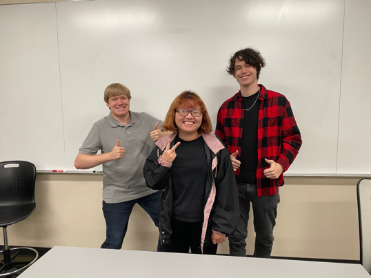

# LightUp: Teaching Programming Basics with Scratch
## Description
-	Difficulty Level: Beginner
-	Target Audience: High School - College
-	Duration of workshop: 75-120 minutes
-	Needed materials: Computer, Internet Access, Starter Files
-	The goal of this project is to introduce students to basic programming topics such as if statements and loops by using Scratch sprites and coordinates.
-	By participating in this workshop students will get to experiment with Scratch a free block based coding tool created by MIT to generate their own mini programming project.
-	The Technology Ambassador Program ([TAP](https://www.ggc.edu/academics/school-of-science-and-technology/research-internships-service-learning/technology-ambassador-program)) at GGC strives to break the misconceptions of the IT field by providing fun workshops for students of all backgrounds. TAP students design engaging and fun outreach workshops to encourage interest in IT and STEM.

## Advisors
-	Dr. Wei Jin
-	Dr. Xin Xu
## Team
-	Sterling Abrams
-	Anh Thu Nguyen
-	Jared Alt   
### Team Photo
  
(Left: Sterling Abrams, Middle: Anh Thu Nguyen, Right: Jared Alt)  

## Publications

## Outreach Activities 
1.	TAP Expo, Oct 11 2022, Georgia Gwinnett College - To promote IT field and the TAP program to college students
2.	Discovery High School, Oct 15 2022, Discovery Highschool -  To promote IT field to highschool and middle school students
3. Class Workshops, Oct 26 2022, Oct 28 2022, Nov 2 2022 - To promote IT field to non-IT college students

## Similar projects

## Technology 
This project uses Scratch, a free online tool that uses block programming.  
 
(Scratch)  
 
(Scratch Block Coding sample)

## Demo Video
This is short video intended to show users what Scratch's block coding enviroment looks like. [LightUp Demo Video](https://youtu.be/svz6xLvvvII)

## Project Setup/Installation
To start the workshop please follow these steps: 
1. [Download LightUp](https://github.com/TAP-GGC/LightUp-Teaching-Programming-Basics-with-Scratch/blob/main/Documents/Download%20LightUp.pdf) 

After getting the workshop, you will notice that there are three ways to complete the workshop. Each way comes with pictures, videos, and/or written instructions to better help you understand what this project is about. Please choose the way that works best for you and/or your classroom needs. 

2. To get the workshop instructions as a PDF, please use the following links: 
   a. [LightUp Workshop Part 1 PDF](https://github.com/TAP-GGC/LightUp-Teaching-Programming-Basics-with-Scratch/blob/main/Documents/Workshop%20Instructions/LightUp%20Workshop%20Part%201.pdf)  
   b. [LightUp Workshop Part 2 PDF](https://github.com/TAP-GGC/LightUp-Teaching-Programming-Basics-with-Scratch/blob/main/Documents/Workshop%20Instructions/LightUp%20Workshop%20Part%202%20%E2%80%93%20Falling%20Arrows.pdf) 
   c. [LightUp Workshop Part 3 PDF](https://github.com/TAP-GGC/LightUp-Teaching-Programming-Basics-with-Scratch/blob/main/Documents/Workshop%20PDF%20Instructions/LightUp%20Workshop%20Part%203%20%E2%80%93%20Hit%20Registry.pdf) 
   d. [LightUp Workshop Part 4 PDF](https://github.com/TAP-GGC/LightUp-Teaching-Programming-Basics-with-Scratch/blob/main/Documents/Workshop%20PDF%20Instructions/LightUp%20Workshop%20Part%204%20%E2%80%93%20Add%20Difficulty.pdf)
3. To get the workshop instructions as a PowerPoint, please use the following links: 
   a. [LightUp Workshop PowerPoint - Part 1 and 2 ](https://github.com/TAP-GGC/LightUp-Teaching-Programming-Basics-with-Scratch/blob/main/Documents/Workshop%20Instructions/LightUp%20Workshop%20Part%201.pdf)  
   b. [LightUp Workshop PowerPoint - Part 3 and 4 ](https://github.com/TAP-GGC/LightUp-Teaching-Programming-Basics-with-Scratch/blob/main/Documents/Workshop%20Instructions/LightUp%20Workshop%20Part%202%20%E2%80%93%20Falling%20Arrows.pdf)
4. To get a video walkthrough of the workshop, please use these videos: 
   a. [LightUp Workshop Part 1 - Turn on Lights](https://youtu.be/YsP2XbsBGIw) 
   b. [LightUp Workshop Part 2 - Falling Arrows](https://youtu.be/8Rmc1j86FfU) 
   c. [LightUp Workshop Part 3 - Hit Registry](https://youtu.be/snOWcFpRPqM) 
   d. [LightUp Workshop Part 4 - Add Difficulty](https://youtu.be/wQRQuIe1nRA)

The final workshop is extra and cvers how to clean up the LightUp game. The workshop goes through the process of how to make the game flow better for the user and creates an end screen which then stops the game and resets everytime a user starts the game.
[LightUp Workshop Clean Up Game Part 1](https://github.com/TAP-GGC/LightUp-Teaching-Programming-Basics-with-Scratch/blob/main/Documents/Workshop%20PDF%20Instructions/LightUp%20Workshop%20-%20Clean%20Up%20Game%20Part%201.pdf)
[LightUp Workshop Clean Up Game Part 2](https://github.com/TAP-GGC/LightUp-Teaching-Programming-Basics-with-Scratch/blob/main/Documents/Workshop%20PDF%20Instructions/LightUp%20Workshop%20-%20Clean%20Up%20Game%20Part%202.pdf)
[LightUp Workshop Clean Up Game Part 3](https://github.com/TAP-GGC/LightUp-Teaching-Programming-Basics-with-Scratch/blob/main/Documents/Workshop%20PDF%20Instructions/LightUp%20Workshop%20-%20Clean%20Up%20Game%20Part%203.pdf)
[LightUp Workshop Clean Up Game Part 4](https://github.com/TAP-GGC/LightUp-Teaching-Programming-Basics-with-Scratch/blob/main/Documents/Workshop%20PDF%20Instructions/LightUp%20Workshop%20-%20Clean%20Up%20Game%20Part%204.pdf)
